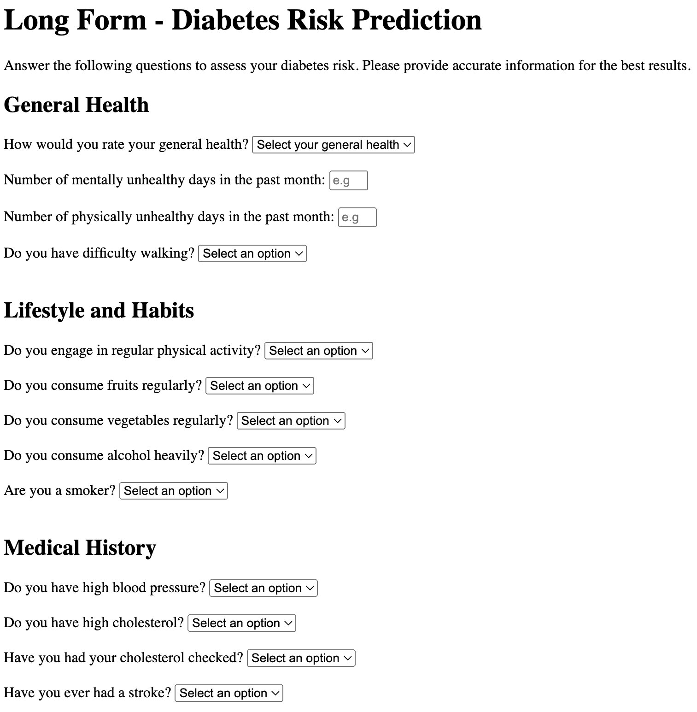

# Diabetes Risk Prediction Project


## Table of Contents
1. [Overview](#overview)
2. [Key Questions](#key-questions)
3. [Dataset](#dataset)
4. [Steps to Create the Model](#steps-to-create-the-model)
5. [Results](#results)
6. [How to Replicate This Project](#how-to-replicate-this-project)
7. [Deployment](#deployment)
8. [Testing](#testing)
9. [Screenshots](#screenshots)
10. [Future Improvements](#future-improvements)
11. [Acknowledgments](#acknowledgments)
 
## Overview

This project explores the use of machine learning to predict diabetes risk levels using survey data from the Behavioral Risk Factor Surveillance System (BRFSS). The primary objectives were to identify key risk factors, develop a short-form survey for prediction, and evaluate the performance of various machine learning models.

## Key Questions

1. Can survey questions from the BRFSS provide accurate predictions of whether an individual has diabetes?
- Yes, using machine learning models trained on BRFSS survey data, accurate predictions were achieved. Features like BMI, Age, and General Health contributed significantly to the model's performance.
What risk factors are most predictive of diabetes risk?

2. Through feature selection, the following were identified as the most predictive risk factors:
- Top Predictors: BMI, Age, General Health (GenHlth), High Blood Pressure (HighBP), High Cholesterol (HighChol).
- Additional Factors: Income, Education, Physical Health (PhysHlth), Smoker status, and Sex.

3. Can we use a subset of the risk factors to accurately predict whether an individual has diabetes?
- Yes, reducing the features to the top 10 maintained robust predictive performance, with an ROC-AUC of 77% for the short form.

4. Can we create a short form of questions from the BRFSS using feature selection to accurately predict if someone might have diabetes or is at high risk of diabetes?
- A short form with 10 key features was created. It simplifies user input while maintaining strong prediction accuracy.

## Dataset

- Source: Behavioral Risk Factor Surveillance System (BRFSS) 2015
- Size: 253,680 entries and 22 columns.
- Target Variable: Diabetes_012 (three classes: Non-Diabetes,Pre-Diabetes, Diabetes).
- Features: Survey questions and health indicators, such as BMI, General Health, and Smoker status.

## Steps to Create the Model

1. Data Preprocessing
- Missing Data: Verified that the dataset contained no null values.
- Duplicate Removal: Reduced the dataset size from 253,680 to 229,781 by removing duplicate rows.
- Class Distribution: Addressed significant class imbalance:
    - Non-Diabetes (84%)
    - Pre-Diabetes (2%)
    - Diabetes (14%)

2. Exploratory Data Analysis
- Distribution Analysis: Visualized target variable distribution.
- Feature Relationships: Explored relationships between features and diabetes risk.

3. Feature Selection
- Identified the top 10 features using Random Forest feature importance:
    - Key Features: BMI, Age, GenHlth, HighBP, HighChol, Income, Education, PhysHlth, Smoker, Sex.

4. Oversampling
- Applied SMOTE and ADASYN to balance the dataset and reduce model bias.

5. Model Training
- Trained three machine learning models:
    - Logistic Regression
    - Random Forest
    - XGBoost

6. Model Evaluation
- Evaluated using metrics such as accuracy, precision, recall, F1-score, and ROC-AUC.


## Results 

### 1. Short Form (10 Features)

The short form uses the top 10 features identified during feature selection. It offers a simpler, user-friendly interface while maintaining robust predictive performance. Below are the comparative metrics for the short form:

| Metric            | Logistic Regression | Random Forest | XGBoost  |
|--------------------|---------------------|---------------|----------|
| Accuracy           | 64%                | 80%           | 84%      |
| Precision (1.0)    | 3%                 | 0%            | 0%       |
| Recall (1.0)       | 25%                | 0%            | 0%       |
| F1-Score (1.0)     | 5%                 | 0%            | 0%       |
| Precision (2.0)    | 32%                | 38%           | 48%      |
| Recall (2.0)       | 62%                | 51%           | 23%      |
| F1-Score (2.0)     | 42%                | 43%           | 30%      |
| ROC-AUC            | **77%**            | **74%**       | **73%**  |

### 2. Long Form (21 Features)

The long form includes all 21 features from the BRFSS dataset, providing a more comprehensive analysis. While it achieves slightly higher overall accuracy, it requires more user input.

| Metric            | Logistic Regression | Random Forest | XGBoost  |
|--------------------|---------------------|---------------|----------|
| Accuracy           | 64%                | 84%           | 84%      |
| Precision (1.0)    | 3%                 | 0%            | 0%       |
| Recall (1.0)       | 26%                | 0%            | 0%       |
| F1-Score (1.0)     | 5%                 | 0%            | 0%       |
| Precision (2.0)    | 32%                | 47%           | 48%      |
| Recall (2.0)       | 61%                | 55%           | 23%      |
| F1-Score (2.0)     | 42%                | 50%           | 30%      |
| ROC-AUC            | **77%**            | **76%**       | **74%**  |

### 3. Comparative Visualizations

#### Class Distribution
The distribution of target classes highlights the significant class imbalance, with **Non-Diabetes (0)** making up 84% of the dataset, while **Pre-Diabetes (1)** and **Diabetes (2)** account for much smaller proportions.


#### Feature Importance
The plot below shows the top 10 features identified during feature selection, ranked by their importance scores from the Random Forest model.


#### Model Comparison
This grouped bar chart compares the accuracy, recall, and ROC-AUC across the three models (Logistic Regression, Random Forest, and XGBoost) for both the short and long forms.


### 4. Model Conclusions

- The short form provides a balance between simplicity and accuracy, achieving an ROC-AUC of 77% with only 10 features.
- The long form achieves slightly better overall accuracy and recall at the expense of requiring more user input.
- Logistic Regression was chosen as the final model for deployment due to its interpretability, ease of deployment, and consistent performance on key metrics.

## Why Logistic Regression?

Logistic Regression was chosen as the final model because:
- Simplicity and Interpretability:
    - Easily explains the relationship between features and the outcome.
- Performance:
    - Achieved strong performance metrics, with an ROC-AUC of 77% and reliable recall for predicting diabetes.
- Alignment with Project Goals:
    - The project emphasized simplicity and usability, which aligns well with Logistic Regression.
- Ease of Deployment:
    - Computationally efficient and well-suited for deployment in lightweight applications.

## How to Replicate This Project 

Follow the steps below to set up and replicate this project on your local machine.

### **1. Prerequisites**
- Before starting, ensure you have the following installed:
    - Python 3.8 or higher
    - Git
    - Required Python libraries (listed in `requirements.txt`)

### **2. Clone the Repository**
- Clone the project repository to your local machine:

    ```bash
    git clone https://github.com/LeslieBarrera/project-2-diabetes-risk-prediction.git
    cd project-2-diabetes-risk-prediction
    ```

### **3. Install Dependencies

    pip install -r requirements.txt

### **4. Run the Flask Application 

    ```bash
    python app.py
    ```

- The app will start running on http://127.0.0.1:5000. Open this URL in your browser to access the interface.

### **5. Explore the Jupyter Notebook 
- The project includes a Jupyter Notebook (notebook.ipynb) detailing data preprocessing, feature selection, and model training:

    ```bash
    jupyter lab
    ```

### **6. Dataset
- The dataset (diabetes_012_health_indicators_BRFSS2015.csv) is included in the repository under the data folder.
- Preprocessing steps are applied directly in the notebook.

### **7. Test the Application 
- Use the Short Form to test predictions with 10 key features.
- Use the Long Form for more comprehensive predictions using all 21 features.

### **8. Deployment (Optional)
- To deploy the application to a cloud platform like Render:
    1. Follow the Render deployment steps in the Deployment section of this README.
    2. Ensure your models (diabetes_short_form_model.pkl and long_form_model.pkl) are included in the repository.
    3. Update your Render settings to point to the correct branch (e.g., main).

### Notes
- Ensure Flask is properly installed in your environment.
    - If you encounter issues, check that all dependencies are installed correctly using:

    ```bash
    pip freeze
    ```

- For deployment, additional configurations (e.g., requirements.txt, Procfile) may be required.

## Deployment

### Flask Application
- Short Form:
    - Input: 10 features.
    - Output: Risk level (Non-Diabetes, Pre-Diabetes, Diabetes) and confidence percentages.
- Long Form:
    - Input: 21 features.
    - Output: Risk level (Non-Diabetes, Pre-Diabetes, Diabetes) and confidence percentages.

### Live Demo
- Hosted on Render, with a user-friendly interface for both short and long forms.
    https://project-2-diabetes-risk-prediction.onrender.com

## Testing

To ensure the reliability and functionality of the project, follow the steps below to test both the short form and long form models, as well as the overall application.

### **1. Testing Locally**
1. **Start the Flask App**:
   - Run the application locally:
     ```bash
     python app.py
     ```
   - Access the app at `http://127.0.0.1:5000` in your browser.

2. **Test Short Form**:
   - Navigate to the "Short Form" page.
   - Input realistic values for the 10 key features (e.g., BMI, Age, Smoker status).
   - Verify that:
     - The app generates a prediction (Non-Diabetes, Pre-Diabetes, Diabetes).
     - Probabilities for each class are displayed accurately.

3. **Test Long Form**:
   - Navigate to the "Long Form" page.
   - Fill out the form with values for all 21 features.
   - Verify that:
     - The app generates a prediction.
     - Probabilities for each class are displayed accurately.

4. **Check Edge Cases**:
   - Test edge cases such as:
     - Missing inputs (ensure defaults or errors are handled).
     - Extreme values (e.g., BMI > 50 or < 10).
     - Invalid inputs (e.g., text in numeric fields).

## Screenshots 
Below are screenshots showcasing the application’s interface and functionality:

### **1. Home Page**
- The landing page allows users to choose between the Short Form and Long Form options.


### **2. Short Form**
- A quick assessment form using the top 10 features identified during feature selection.


### **3. Long Form**
- A comprehensive form with all 21 features for detailed predictions.



### **4. Results Page**
- Displays the predicted risk level and confidence percentages for each class (Non-Diabetes, Pre-Diabetes, Diabetes).


## Future Improvements

While this project demonstrates significant progress in predicting diabetes risk using both a short form and a long form of questions, several areas for improvement and further exploration remain:

### **1. Addressing Limitations of the Short Form Model**
- The short form model performs well for very unhealthy cases, likely due to the alignment of the 10 selected features with clear patterns in the training data.
- However, for healthier or borderline inputs, the reduced number of features may limit the model's ability to capture nuanced risk factors. Future iterations should:
  - **Refine Feature Selection**: Experiment with alternative combinations of features to enhance predictive accuracy while maintaining simplicity.
  - **Feature Engineering**: Explore the creation of derived features (e.g., interaction terms like BMI × Age) to capture more complex relationships without increasing the number of inputs.

### **2. Enhancing Model Performance**
- **Advanced Models**: Investigate more sophisticated algorithms (e.g., Gradient Boosting, Neural Networks) for the short form to improve accuracy for borderline cases.
- **Explainability**: Use tools like SHAP (SHapley Additive exPlanations) to better understand the contribution of each feature to the model's predictions, helping to identify potential gaps in the feature set.

### **3. Adjusting Decision Thresholds**
- Consider customizing the decision thresholds for the short form to reduce false positives or false negatives, especially for borderline or healthy users.

### **4. Expanding and Validating the Dataset**
- Incorporate additional data from more diverse populations to improve the model's generalizability.
- Perform external validation with a dataset outside the BRFSS to assess performance and refine the model for broader use.

### **5. Improving the User Interface**
- Enhance the user-friendly design of both forms to provide better guidance on inputting data.
- Add explanations for predictions (e.g., why the model predicted a specific risk level) to improve transparency and trustworthiness for users.

### **6. Deployment and Scalability**
- Expand the app’s deployment to ensure scalability and robustness under higher user loads.
- Implement a feedback mechanism for users to share their results or experiences to refine the models and interface over time.

## Acknowledgments 

This project was made possible through the collaboration, support, and resources provided by various individuals and organizations. We would like to express our gratitude to the following:

### **Team Members**
- David Melara 
- Steven Sarvas
- Ray George
- Leslie Barrera 

### **Instructors and Mentors**
- For providing guidance and feedback throughout the project, and for sharing invaluable insights into machine learning and model deployment.

### **Data Source**
- **Behavioral Risk Factor Surveillance System (BRFSS)**: For providing the dataset used to train and evaluate the models. More information can be found [here](https://www.cdc.gov/brfss/).

### **Tools and Frameworks**
- **Python Libraries**:
  - `pandas`, `numpy`, `matplotlib`, `seaborn` for data preprocessing and visualization.
  - `scikit-learn`, `xgboost`, `imbalanced-learn` for machine learning and oversampling.
- **Flask**: For building the web application.
- **Render**: For deploying the application.

### **OpenAI GPT Assistance**
- Used as a resource to assist with technical questions, documentation, and improving project workflows.

